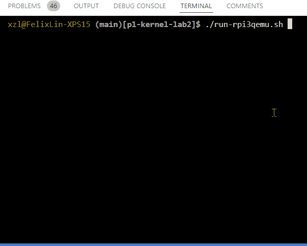

# UVA-OS WORLD2 "Embedded" 
## To UVA students: the code will become available in Sp25

This is one part of the UVA-OS class (CS4414/CS6456). 

[OVERVIEW](https://github.com/fxlin/cs4414-main) |
[WORLD1](https://github.com/fxlin/uva-os-world1) |
[WORLD2](https://github.com/fxlin/uva-os-world2) |
[WORLD3](https://github.com/fxlin/uva-os-world3) |
[WORLD4](https://github.com/fxlin/uva-os-world4) |
[WORLD5](https://github.com/fxlin/uva-os-world5) 

Students: see [quests-lab2.md](quests-lab2.md)

## GALLERY


<video controls src="gamehat 2donuts.mp4" title="2 donuts on rpi3(gamehat)" width="300"></video>



## DESIGNS

This OS resembles what you would see in an "embedded systems" course. In addition to World 1 features, it can run multiple tasks and preempt their execution. However, everything still runs at EL1.


✅ Scheduler: cooperative & preemptive

✅ Memory allocator (simple)

✅ Task management (sleep, wait, exit, kill)

⛔ EL1 only
⛔ No virtual memory 


## Build for rpi3 QEMU

To clean up:
```sh
./cleanall.sh
```

To build everything:
```sh
export PLAT=rpi3qemu
./makeall.sh
```

To run on qemu:
```sh
./run-rpi3qemu.sh
```

## Build for rpi3 (hardware)

To clean up:
```sh
./cleanall.sh
```

To build everything:
```sh
export PLAT=rpi3
./makeall.sh
```

(One time): get a blank SD card, burn the provided image with Win32DiskImager, 
balenaEtcher, or Raspberry Pi Imager. 

Copy the kenrel image `kernel8.img` to the partition named `bootfs` and boot. 