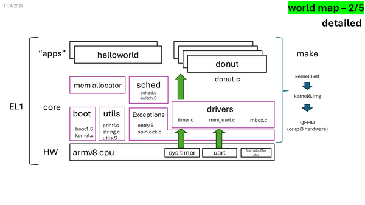
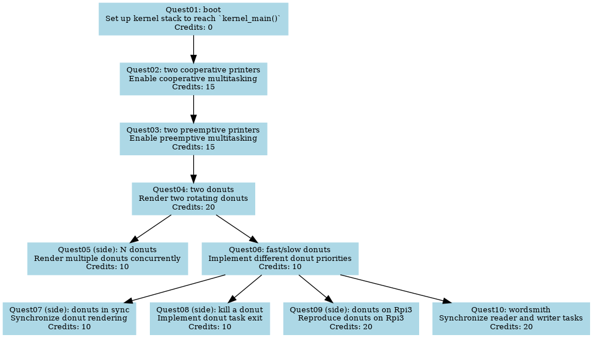
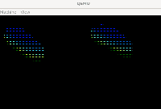
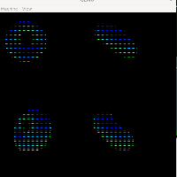
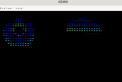
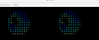

# Quests for World 2 "Embedded"

Total estimated time: XXX hours

<!-- convert Slide4.PNG -resize 600x Slide4-resized.png -->




| Quest Name | Description | Credits |
|------------|-------------|---------|
| Quest01: boot | Set up kernel stack to reach `kernel_main()`. | 0 |
| Quest02: two cooperative printers | Enable cooperative multitasking. | 15 |
| Quest03: two preemptive printers | Enable preemptive multitasking. | 15 |
| Quest04: two donuts | Render two rotating donuts. | 20 |
| Quest05 (side): N donuts | Render multiple donuts concurrently. | 10 |
| Quest06: fast/slow donuts | Implement different donut priorities. | 10 |
| Quest07 (side): donuts in sync | Synchronize donut rendering. | 10 |
| Quest08 (side): kill a donut | Implement donut task exit. | 10 |
| Quest09 (side): donuts on Rpi3 | Reproduce donuts on Rpi3. | 20 |
| Quest10: wordsmith | Synchronize reader and writer tasks. | 20 |


#### Total credits: 140 (main 80; side 60)

Credits exceeding 100 will be considered as bonus.




**NOTE**. In all writeup below, we will refer to C function names and assembly
labels. We will not always give out the file names. To quickly locate them, use
vscode `ctrl+t` for C functions and `ctrl+shift+f` for assembly labels.

**NOTE**. In all coding quests, see the comments in the code for hints
and instructions.

**NOTE**. For picture/video deliverables, see  [requirements](./submission.md).

## Quest01: boot

complete boot2.S: set up the kernel stack, so that the kernel execution can reach
`kernel_main()`. To help coding, use GDB to debug the boot process. 

Once successful, you should see the familiar message: 

````
------ kernel boot ----- core 0
build time (kernel.c) ...
````
😀 DELIVERABLE: none. 

## Quest02: two cooperative printers

OVERVIEW: we will enable cooperative multitasking. To do that, we complete
task creation and context switch. 
Note that the context switch in this quest is for two tasks to yield to each other voluntarily via function calls. This means their execution is not interrupted at arbitrary instructions. This is fundamentally different from preemptive multitasking, which we will explore in the next quest.
Make sure you understand these concepts. 

- in unittest.c, Understand `test_kern_tasks_print()` and the functions called by it.  
in `kernel_main()` of kernel.c, Place a call to the former function to
  launch two tasks.

- Task creation. Understand and then complete `copy_process()` in sched.c. 

- Context switch. Understand `switch_to()` in sched.c and its relation to `cpu_switch_to()` in switch.S.
Complete  `switch_to()`. 

- Complete assembly: `cpu_switch_to()` in switch.S (with the help of AI). Place a call it in `switch_to()` in sched.c.

- Scheduler. Grasp schedule() in sched.c. Complete `schedule()` by placing calls to `switch_to()`. 

> Note that schedule() is invoked for both cooperating (via yield() which directly calls schedule()) 
and preemptive scheduling (next quest, via timer interrupt which calls schedule()).

- The birth of a new task. Complete `ret_from_fork()` in entry.S (assembly).

😀DELIVERABLE: you will see two tasks printing their own messages. Take a
photo. 

### what if a task returns (optional for UG; required for GRAD)? 

Think about: what happens when a task returns from its body function? Which
instructions will be executed next? Use GDB to verify your thoughts.

😀 DELIVERABLE: a writeup of no more than 500 words. 

## Quest03: two preemptive printers

OVERVIEW: we will bring up preemptive multitasking. To do that, we will enable
periodic timer interrupts. Then we will invoke the scheduler in the timer
interrupt handler, which preempts the current task.

- Understand `generic_timer_init()`. Understand its difference from sys_timer.
Place a call to it in `kernel_main()` to enable timer interrupts.

- Place `el1_irq` in the irq vector table (`entry.S`)

- Turn on the CPU irq in `kernel_main()`.

- Understand the role of `timer_tick()` in `sched.c`. In
`handle_generic_timer_irq()`, call `timer_tick()`. 

- CHECKPOINT. If everything goes well, at this time you should see `handle_irq()` called
periodically, which calls `handle_generic_timer_irq()`, which calls
 `timer_tick()`, which calls `schedule()`. Add debug messages in these places to
 verify this. Turn off the messages after verification.

 > At this point, `kernel_entry/exit` are not complete. 
 If you let the kernel to continue executing, the kernel may crash
 after returning from an exception (eret). 

- Understand `kernel_entry` and `kernel_exit` in `entry.S`. Understand their
  differences from the same macros that we saw in WORLD1. Complete them. 

- Determine the value of `S_FRAME_SIZE` in `entry.h`.

<!-- - ~~Understand `schedule()`. Complete `schedule()` by placing calls to
  `switch_to()`.~~  -->

😀DELIVERABLE: you will see two tasks printing their own messages, and the
messages are interleaved. Take a screenshot.

## Quest04: two donuts

OVERVIEW: to visualize our tasks, we will launch two tasks, each rendering a
rotating donut on the screen. 

- make sure you undrestand `donut_pixel()` in donut.c, especially how it renders
  different donuts to differnet screen locations via the "idx" argument. 

- complete `test_kern_tasks_donut()` and complete the functions called by it: 
spawn multpile tasks, each rendering a donut by
  calling `donut_pixel()`.

😀DELIVERABLE: you will see two donuts __takes turns__ to rotate on the screen. Record one video showing the visual effect (5--10sec).



**NOTE**: all image/video samples are intentionally made small. Your deliverable must be in full resolution. [See requirements](./submission.md).

## Quest05 (side): N donuts

Note: each donut shall still be rendered by a separate task. 

- change the number of concurrent donuts to 4, which shall be rendered to the
  screen in a 2x2 grid. `donut_pixel()` already supports this. 



- supports more concurrent donuts, say 9 or 16, which shall be rendered to the
  screen in a 3x3 or 4x4 grid. You need to hack donut.c to support this.

- Get as many donuts to run as you can.

😀DELIVERABLE: Record a video (5--10sec).

## Quest06: fast/slow donuts

- Check `task_struct::credits` and `task_struct::priority` in sched.h.
Understand how credits and priority affect the scheduling, by checking all code
that references to these two fields, e.g. 
   - `sched_init()`, `schedule()`, and `timer_tick()` in sched.c 

- Add code to `test_kern_tasks_donut()` and/or `kern_task_donut()` to set
  different priorities for different donuts, to implement the following visual
  effects: 
   1. some donuts make more turns than others.


    
😀DELIVERABLE: Record videos, one for each visual effect (5--10sec) using your phone.

## Quest07 (side): donuts in sync

The idea: for multiple donuts to render in sync, `donut_pixel` may call 'yield()' 
after it renders each frame, so other donuts can run (for a frame).

<!-- - ~~Complete the code of `yield()` in `sched.c`.~~ -->

Visual effects: 

1. Add call to `yield()` in `donut_pixel()` to implement frame yield. 



2. Change the code, so that the donuts turn simluatenously, but at different speeds.

😀DELIVERABLE: Record videos, one for each visual effect (5--10sec) using your phone.

## Quest08 (side): kill a donut

- Complete `exit_process()` in sched.c.

- Add code to `donut_pixel()`, so that one donut task exits, either after running 
for rougly 3 seconds, or in response to a key press (via UART irq), cf the "UART rx irq" task in WORLD1.  

- Other donuts shall continue to run.

😀DELIVERABLE: Record one video showing the visual effect (5--10sec) using your
phone.

## Quest09 (side): donuts on Rpi3

Reproduce the above donut visual effects on Rpi3.


Reference:

<video controls src="gamehat 2donuts.mp4" title="Title"></video>

😀 DELIVERABLE: Record videos, one for each visual effect (5--10sec) using your
phone.

## Quest10: wordsmith

> This quest may take more time than others.

- Understand `test_kern_reader_writer()` and the two tasks it creates. 
Call it from `kernel_main()`. Note: don't forget to comment out prior testing calls there. 

- Understand `do_write()` and `do_read()`. Complete the functions with calls to
  `wakeup()` and `sleep()` to synchronize the two tasks.

- Understand the idea of `sleep()` and `wakeup()` in sched.c. 
Complete their code, including `wakeup_nolock()` which is called by `wakeup()`.
The code will be revisited after we make a multicore kernel. 

- you will see the reader task printing poem it received. 

😀DELIVERABLE: 
Record a video (5--10sec) using your phone.

Reference: 


